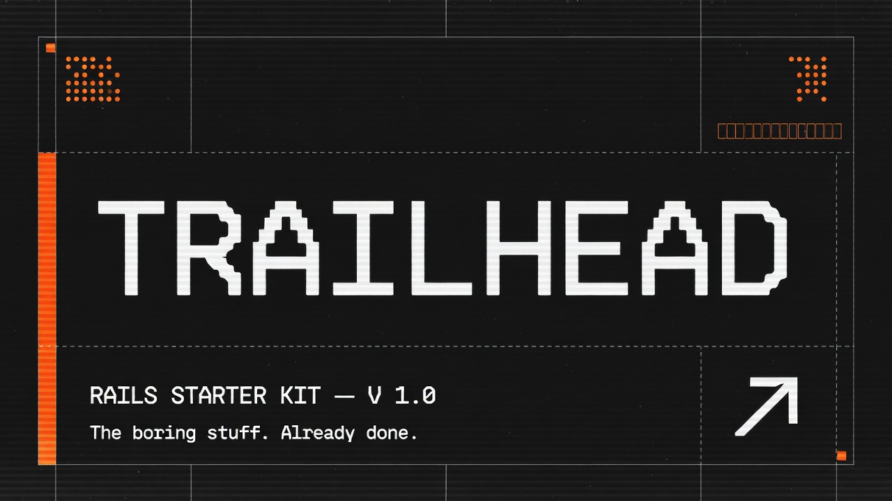

# Trailhead — Rails 8 SaaS Starter Template

**The boring stuff, already done.**

Production-ready Rails 8 starter for B2B SaaS with multi-tenancy, team management, Stripe billing, and admin dashboard.

[](https://railway.com/new/template/trailhead?utm_medium=integration&utm_source=button&utm_campaign=trailhead)

## Stack

- **Rails 8.1** with Hotwire (Turbo + Stimulus)
- **PostgreSQL** with UUID primary keys
- **Tailwind CSS** via `tailwindcss-rails`
- **Devise** authentication (email/password + magic links + TOTP 2FA)
- **Pay** gem for Stripe billing (subscriptions + usage metering)
- **Madmin** admin dashboard
- **Solid Queue** / **Solid Cache** / **Solid Cable** (database-backed infra, no Redis required)
- **Kamal** deployment (Hetzner-ready)
- **Honeybadger** error tracking
- **RSpec** + **FactoryBot** testing

## Architecture

### Multi-Tenancy

Row-level tenancy via the `Account` model. Every tenant-scoped model includes the `AccountScoped` concern:

```ruby
class Project < ApplicationRecord
  include AccountScoped
end

# In controllers — explicit scoping (no default_scope magic):
@projects = Project.current.order(created_at: :desc)
```

`Current.account` is set per-request in `ApplicationController` via the `AccountScoping` concern.

### Team Roles

Three roles with cascading permissions: `owner > admin > member`

| Role | Billing | Invite Members | Read/Write Data |
|------|---------|----------------|-----------------|
| Owner | ✅ | ✅ | ✅ |
| Admin | ❌ | ✅ | ✅ |
| Member | ❌ | ❌ | ✅ |

### Billing

Stripe integration via Pay gem. Database-backed `Plan` model with:
- Flat monthly/annual pricing
- Seat limits
- Usage quotas (API calls, storage)
- Feature flags

### Sessions

Single-device enforcement — new login destroys previous session. Sessions expire after 30 days of inactivity.

## Quick Start

```bash
git clone <repo-url> trailhead
cd trailhead

bundle install

# Create and migrate database
bin/rails db:create db:migrate db:seed

# Start development server
bin/dev
```

## Demo Accounts

| Role | Email | Password |
|------|-------|----------|
| Admin | admin@trailhead.dev | password123 |
| Owner | james@acmecorp.dev | password123 |
| Member | alice@acmecorp.dev | password123 |

## Admin Dashboard

Madmin admin at `/madmin`. Restricted to users with `admin: true`.

## Environment Variables

See `.env.example` for the full list. Key ones:

```
DATABASE_URL=postgres://...
STRIPE_SECRET_KEY=sk_...
STRIPE_PUBLISHABLE_KEY=pk_...
STRIPE_WEBHOOK_SECRET=whsec_...
HONEYBADGER_API_KEY=...
```

## Deployment

### Railway (One-click)

[](https://railway.com/new/template/trailhead?utm_medium=integration&utm_source=button&utm_campaign=trailhead)

1. Click the button above
2. Add a PostgreSQL service in Railway (auto-links `DATABASE_URL`)
3. Set required env vars:
   ```
   RAILS_MASTER_KEY        # from config/master.key
   SECRET_KEY_BASE         # generate with: rails secret
   HOST                    # your Railway domain, e.g. trailhead.up.railway.app
   ```
4. Optional — add a worker service using the same repo with start command:
   ```
   bundle exec rails solid_queue:start
   ```

Railway auto-runs `db:prepare` on first deploy via `railway.toml`. No Redis required — Solid Queue/Cache/Cable are database-backed.

### Kamal (Hetzner / self-hosted)

1. Update `config/deploy.yml` with server IPs, domain, registry
2. Set secrets in `.kamal/secrets`
3. `kamal setup` (first deploy) or `kamal deploy` (subsequent)

CI/CD via `.github/workflows/ci.yml`: RuboCop → Brakeman → Bundle Audit → RSpec → auto-deploy on main.

## Testing

```bash
bundle exec rspec
```

## Documentation

- [Architecture Blueprint](.research-docs/architecture.md)
- [Design Decisions](.research-docs/decisions.md)
- [Research Findings](.research-docs/research-findings.md)
- [RailsBlocks Integration](docs/rails-blocks.md)

## License

MIT
